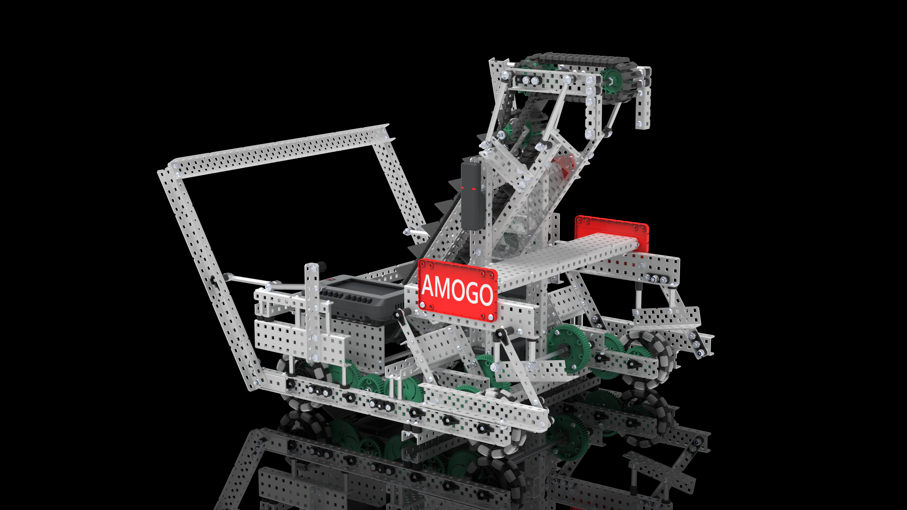

# Harvard-Westlake's AMOGO - VEXcode

This was made on VEXos 1.0.13
---
AMOGO (alliance mobile goal) is a ring focused robot that can fill a goal with rings in autonomous, hold an alliance mobile goal, platform, lift tipped mobile goals, and hold a neutral goal to the side of the robot. 
   

## Controls
- `L1` Mogo Toggle.  When the lift is out and the button is held, the lift will come to a middle position
- `L2` Tilter Toggle
- `R1` Intake + Conveyor In
- `R2` Intake + Conveyor Out
- Tank Drive (by default)

## Features
 - Simple time-based autonomous routine (moves alliance goal from the autonomous line).
 - Conveyor functions for opcontrol and autonomous.
 - Mogo functions for opcontrol.
 - Tilter functions for opcontrol.
 - Voltage control for the drive.

## External Links

Reveal  
VEX Forum with CAD  

Basic Code  
[DOGO VEXcode](https://github.com/Unionjackjz1/HW-DOGO-VEXCODE/)    
[AMOGO VEXcode](https://github.com/Unionjackjz1/HW-AMOGO-VEXCODE/)  

Advanced Code  
[DOGO PROS](https://github.com/Unionjackjz1/HW-DOGO-PROS/)  
[AMOGO PROS](https://github.com/Unionjackjz1/HW-AMOGO-PROS/) 

## Contributors
Thank you to the following for making make this project come to life:
- Avi Dube
- Ben Ren
- Dru Reed
- Jake Futterman
- Jess Zarchi
- Tripp Reed
- Yuanyang Lu
